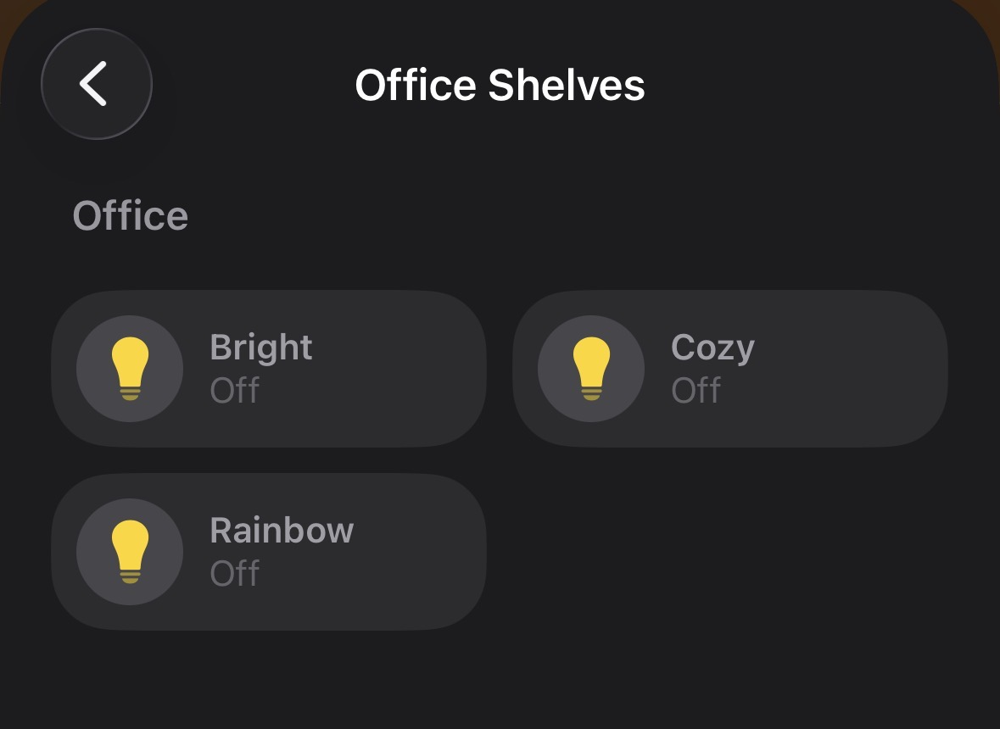

# Homebridge WLED Presets

### (@ncovercash/homebridge-wled-presets)

[](https://www.npmjs.com/package/@ncovercash/homebridge-wled-presets)
[](https://www.npmjs.com/package/@ncovercash/homebridge-wled-presets)
[](https://github.com/ncovercash/homebridge-wled-presets/commits)
[](https://github.com/ncovercash/homebridge-wled-presets/actions)
[](https://www.typescriptlang.org/)
[](https://nodejs.org/)
[](LICENSE)

Homebridge Plugin for WLED Strips ([WLED-Project by Aircoookie](https://github.com/Aircoookie/WLED)) centered around presets. Based on the original [homebridge-simple-wled](https://github.com/jstrausd/homebridge-simple-wled) plugin, however, this version is focused around presets and presets only!

Presets show up as individual Lightbulb services in HomeKit, allowing you to easily control your WLED devices between your favorite options and leaving the fancier customization options to the WLED web interface. This also means Siri commands are as easy as `Hey Siri, turn on LED Strip Disco Mode` and that full automation support is available.



## Important Nuances

Each individual preset can have its brightness controlled (and will default to the preset's defined brightness when first turned on, if set). As you would expect, turning one preset on will indicate the others as off. Additionally, changes between presets in the web interface will sync to HomeKit.

However, if the controls are changed from a preset to a custom setting, **the previously used preset will still show as “on”**. This avoids confusion as otherwise changing the color would show the LEDs as off (and also make it impossible to turn them off via Siri/etc without first turning them on again).

## ✨ Features

- **WebSocket Support**: Real-time communication with WLED devices via WebSocket for instant updates
- **Homebridge v2 Compatible**: Works with both Homebridge v1.8+ and v2.0+
- **Multiple Host Support**: Control multiple WLED devices with a single accessory
- **Software Update Notifications**: Get notified in logs when a new WLED version is available (currently in logs only)

### ⚙️ Installation / NPM Package

Install via Homebridge UI or NPM: [NPM Package](https://www.npmjs.com/package/@ncovercash/homebridge-wled-presets)

### Manual Configuration

Add the platform to your `config.json` in the platforms section:

```json
{
  "platforms": [
    {
      "platform": "WLED Presets",
      "wleds": [
        {
          "name": "LED-Table",
          "host": "192.168.1.100",
          "log": true
        },
        {
          "name": "LED-Box",
          "host": ["192.168.1.101", "192.168.1.102"]
        }
      ]
    }
  ]
}
```

After editing the config, restart your Homebridge server and add the accessory manually from the Home app.

## 💡💡💡 Multiple WLED Hosts

Control multiple WLED devices with a single accessory by setting `host` to an array or a comma-separated string:

**Important:** The first WLED host acts as the primary device. Changes made to the primary WLED (e.g., via the web panel) will sync to all other WLEDs in the array.

```json5
{
  platform: 'WLED Presets',
  wleds: [
    {
      name: 'LED-Table',
      host: ['192.168.1.100', '192.168.1.101', '192.168.1.102'],
      // or
      host: '192.168.1.100, 192.168.1.101, 192.168.1.102',
    },
  ],
}
```

## Troubleshooting

If presets are not being created or removed, try restarting Homebridge or clearing the accessory cache.

## 🔧 Technical Details

### WebSocket Communication

The plugin uses WebSocket connections (`ws://[WLED-IP]/ws`) for real-time communication:

- Instant state updates from WLED devices
- Automatic reconnection on connection loss
- Message queuing when disconnected
- Support for up to 4 concurrent WebSocket connections per device

## 📝 Development

See [DEVELOPMENT.md](./DEVELOPMENT.md) for local development and build instructions.

## 🤝 Contributing

If you have any ideas or improvements, feel free to fork the repository and submit a pull request.

## 📄 License

ISC
